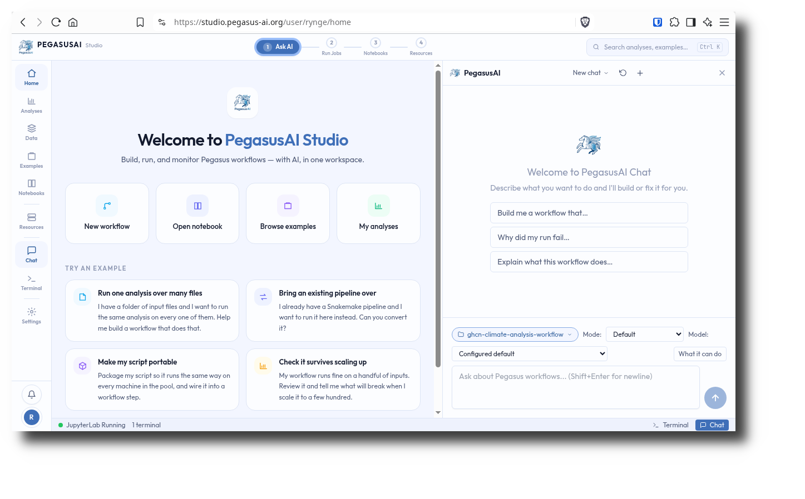

# Pegasus AI Studio

## Overview

Pegasus AI Studio is an Open OnDemand Batch Connect app that launches Pegasus AI as an interactive web server session on HPC clusters. It is designed for users who wants to user AI agents to design and execute scientific workflows.

- Upstream project: [project homepage](https://pegasus-ai.org/) [software homepage](https://pegasus.isi.edu/)

## Screenshots

<!-- A screenshot helps deployers verify their installation and helps users understand what they'll get. -->
<!-- Place images in a screenshots/ or docs/ directory. -->



## Features

- Launches Pegasus AI Studio via web server on compute nodes
- Supports submitting Pegasus jobs to Slurm
- Containerized via Singularity/Apptainer

## Requirements

### Compute Node Software

- Singularity / Apptainer
- RHEL/Rocky/... 9 or greater

### Open OnDemand

- Scheduler: Slurm

## App Installation

```bash
cd /var/www/ood/apps/sys

git clone https://github.com/pegasus-isi/bc_pegasus_ai_studio.git

```

If Apptainer/Singularity is not in the PATH on your compute nodes, update
`template/script.sh.erb` so that Apptainer/Singularity is loaded.

Download one or more Singularity images, and install them in a shared directory:

[https://download.pegasus.isi.edu/ondemand/6.0/]

Update the image path in `form.yml.erb`

## Known Limitations

- Only works on RHEL/Rocky/... 9 or greater, at this point

## Contributing

Contributions are welcome. To contribute:

1. Fork this repository
2. Create a feature branch (`git checkout -b feature/my-improvement`)
3. Submit a pull request with a description of your changes

For bugs or feature requests, [open an issue](https://github.com/pegasus-isi/bc_pegasus_ai_studio/issues).

This app is part of the [OOD Appverse](https://ondemand.connectci.org/affinity-groups/ood-appverse). Join the [Appverse Affinity Group](https://ondemand.connectci.org/affinity-groups/ood-appverse) to connect with other contributors.

## References

<!-- Credit upstream projects and any code you borrowed. -->

- [Pegasus AI](https://pegasus-ai.org/) — the application launched by this OOD app
- [Pegasus WMS](https://pegasus.isi.edu/) — the application launched by this OOD app
- [Open OnDemand](https://openondemand.org/) — the HPC portal framework

## License

[MIT License](LICENSE)

## Acknowledgments

This work is supported by the National Science Foundation award number 2513101.

